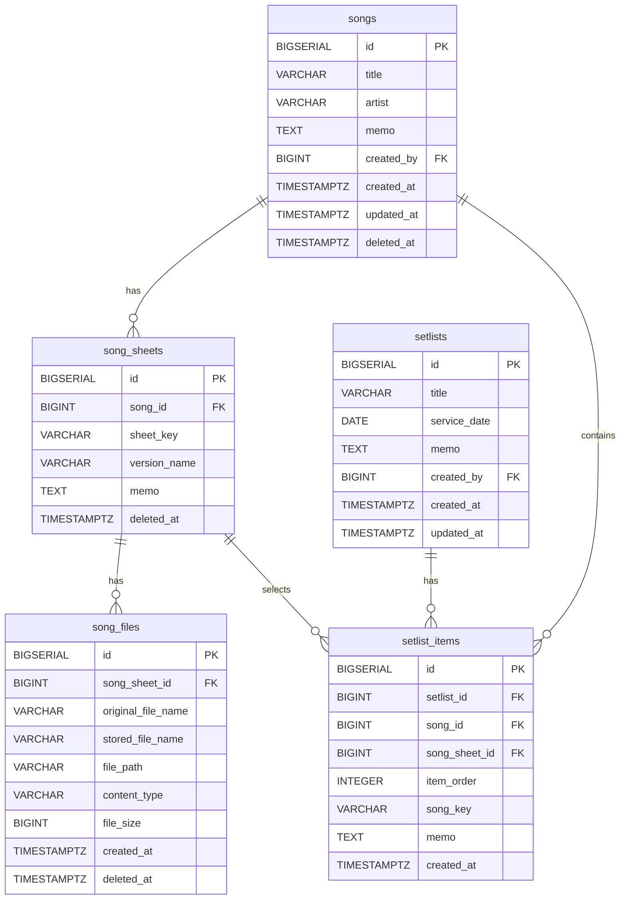

# sheet-music

## ERD



## API

### Songs

`GET /api/songs/{songId}` 응답에는 삭제되지 않은 악보만 `songSheets`로 포함됩니다.

```json
{
  "id": 1,
  "title": "Amazing Grace",
  "artist": "John Newton",
  "memo": "예배곡",
  "songSheets": [
    {
      "songSheetId": 1,
      "sheetKey": "C",
      "versionName": "Original",
      "memo": "기본 악보"
    }
  ],
  "createdBy": null,
  "createdAt": "2026-05-12T23:59:00+09:00",
  "updatedAt": "2026-05-12T23:59:00+09:00"
}
```

### Song Sheets

`song_sheets`는 곡(`songs`)에 속한 악보 버전입니다. 삭제는 `deleted_at`을 기록하는 soft delete로 처리하며, 조회 API는 삭제되지 않은 데이터만 반환합니다. `sheet_key`와 `version_name`은 비워둘 수 있고, 같은 `song_id` 안에서 동일한 `sheet_key`를 여러 번 사용할 수 있습니다.

| Method | Path | Description |
| --- | --- | --- |
| `POST` | `/api/songs/{songId}/sheets` | 곡에 악보를 추가합니다. |
| `GET` | `/api/songs/{songId}/sheets` | 곡의 악보 목록을 조회합니다. |
| `GET` | `/api/song-sheets/{songSheetId}` | 악보 단건을 조회합니다. |
| `PUT` | `/api/song-sheets/{songSheetId}` | 악보 정보를 수정합니다. |
| `DELETE` | `/api/song-sheets/{songSheetId}` | 악보를 soft delete 합니다. |

#### Request

```json
{
  "sheetKey": "C",
  "versionName": "Original",
  "memo": "기본 악보"
}
```

#### Response

```json
{
  "id": 1,
  "songId": 1,
  "sheetKey": "C",
  "versionName": "Original",
  "memo": "기본 악보"
}
```

### Song Files

`song_files`는 악보(`song_sheets`)에 업로드된 파일입니다. 파일은 `./uploads/sheets/{songSheetId}/` 아래에 저장하고, 삭제는 `deleted_at`을 기록하는 soft delete로 처리합니다.

| Method | Path | Description |
| --- | --- | --- |
| `POST` | `/api/song-sheets/{songSheetId}/files` | 악보 파일을 multipart로 업로드합니다. |
| `GET` | `/api/song-files/{songFileId}/download` | 악보 파일을 다운로드합니다. |
| `DELETE` | `/api/song-files/{songFileId}` | 악보 파일을 soft delete 합니다. |

#### Upload Request

```http
POST /api/song-sheets/1/files
Content-Type: multipart/form-data

file=@sheet.pdf
```

#### Upload Response

```json
{
  "id": 1,
  "songSheetId": 1,
  "originalFileName": "sheet.pdf",
  "storedFileName": "550e8400-e29b-41d4-a716-446655440000.pdf",
  "filePath": "./uploads/sheets/1/550e8400-e29b-41d4-a716-446655440000.pdf",
  "contentType": "application/pdf",
  "fileSize": 12345
}
```
