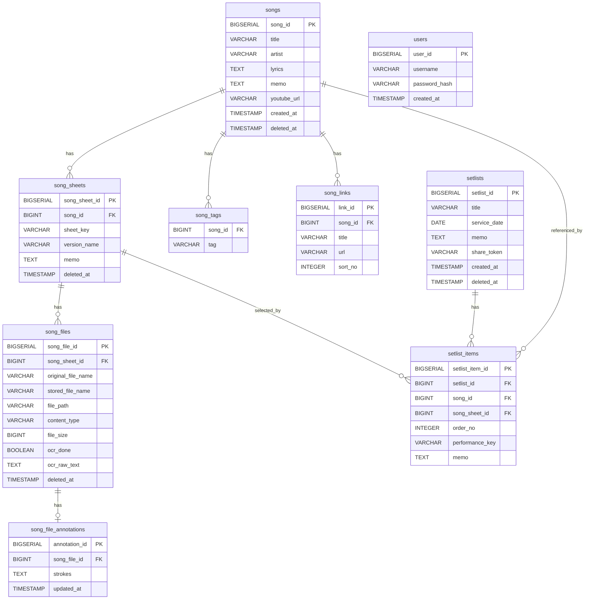

# 악보 정리 앱 (sheet-music)

예배·공연용 악보를 곡 단위로 관리하고, 셋리스트(콘티)를 구성·공유·진행하는 웹 애플리케이션.

| 서비스 | 주소 |
|--------|------|
| 웹앱 | https://worship-sheet.vercel.app |
| 백엔드 API | https://worship-sheet.fly.dev |
| OCR 서비스 | https://worship-sheet-ocr.fly.dev |

> 데이터는 팀 전체가 함께 보는 공용 데이터입니다. 로그인은 접근 제한 용도이며 사용자별로 자료가 분리되지 않습니다.

---

# 📖 사용자 매뉴얼

처음 오셨다면 이 순서대로 따라 하시면 됩니다.

## 1. 로그인 / 게스트로 시작하기
- 앱에 들어가면 로그인 화면이 나옵니다.
- **가입 없이 써보려면 → `게스트로 시작하기` 버튼** 한 번이면 바로 입장합니다.
- 계정으로 쓰려면 `회원가입`으로 아이디/비밀번호를 만든 뒤 로그인합니다.
- 나가려면 우상단 **로그아웃 아이콘**을 누릅니다.

## 2. 홈 화면 보기
로그인하면 **홈**이 먼저 나옵니다. 한눈에:
- **다음 예배** — 가장 가까운 예정 콘티와 D-day
- **즐겨찾기 / 최근 열어본 콘티 / 최근 콘티**
- **자주 쓰는 곡 Top 5** — 콘티에 많이 담긴 곡

상단 메뉴는 **홈 · 콘티 · 악보**, 우측 아이콘은 **기능 요청 💬 · 테마 전환 ☀️ · 로그아웃**입니다.

## 3. 곡(악보) 등록하기
**악보 → `곡 등록`** 으로 들어갑니다.

- 악보 이미지를 올리면 **그 곡의 첫 악보 버전이 자동으로 만들어지고 파일도 첨부**됩니다.
- **`OCR로 정보 채우기`** 버튼을 누르면 이미지에서 제목·키·아티스트·가사를 자동 추출해 채워줍니다. (자동 실행이 아니라 버튼을 눌러야 실행됩니다)
- 제목만 필수이고 키·아티스트·메모는 선택입니다. `저장`을 누르면 등록됩니다.

**여러 곡을 한꺼번에** 올리려면 **악보 → `일괄 업로드`**:
- 이미지를 드래그앤드롭하면 카드가 생깁니다.
- 카드마다 `OCR로 정보 채우기`로 자동 입력하거나 직접 입력한 뒤, `전체 저장`으로 한 번에 등록합니다.

## 4. 곡 찾기
**악보** 목록에서:
- **검색창** — 제목·아티스트·가사로 검색
- **키 입력** — 특정 키(C, G, Am…)로 필터
- **태그 칩** — 여러 개 선택 시 모두 가진 곡만(AND) 표시, `태그 N개 해제`로 초기화
- **정렬** — 이름·아티스트·키·최신·최근 사용순 (선택값은 다음에도 유지)
- 아래로 스크롤하면 자동으로 더 불러옵니다(무한 스크롤). 상단에 **총 N곡** 표시.

## 5. 곡 상세 — 악보 보기 · 수정 · 파일 관리
곡을 누르면 상세로 들어갑니다.
- **악보 슬라이드 뷰어** — ←/→ 키 또는 좌우 버튼으로 페이지 넘김. 크게 보려면 전체화면 뷰어.
- **곡 정보 수정** — 정보 카드의 **연필 ✏️ 버튼**을 누르면 제목·아티스트·메모·태그를 그 자리에서 바로 고칩니다.
- **악보 관리**(`악보 관리` 버튼) — 키/버전별 악보 버전 추가·수정·삭제, 각 버전에 파일 업로드/삭제.
- **가사** — 직접 편집하거나 `OCR로 가사 채우기`로 이미지에서 추출.
- **링크** — YouTube·Spotify·Melon 등 주소만 붙여넣으면 플랫폼을 자동 인식. YouTube는 바로 임베드 재생.
- **사용 이력** — 이 곡이 쓰인 콘티 목록(날짜·제목).
- 저장하면 하단에 **"저장했어요"** 안내가 뜹니다.

## 6. 콘티(셋리스트) 만들기
**콘티 → `새 콘티`**:
- **달력이 바로 펼쳐집니다.** 날짜를 클릭하면 제목 옆에 `2026.07.01 (수)`처럼 표시됩니다.
- 제목(선택)을 넣고, `곡 추가`로 곡을 미리 담을 수 있습니다.
- `생성`을 누르면 콘티가 만들어지고 상세로 이동합니다.

## 7. 콘티에 곡 담기 / 순서 바꾸기
콘티 상세에서:
- **`곡 추가`** → 곡을 검색해 선택 → (선택) 악보 버전 선택 → **연주 키·메모**를 넣고 `추가`.
  - 곡 선택 모달에서 각 악보 버전 옆의 **👁 악보** 버튼으로 미리 볼 수 있고, **연필**로 그 자리에서 키/버전명도 고칠 수 있습니다.
- **순서 변경** — 곡 카드의 **손잡이(⋮⋮)를 잡고 드래그**. 마우스·터치·펜 모두 됩니다.
- 곡별 **연주 키 배지**를 눌러 바로 수정할 수 있습니다.

## 8. 콘티 공유 · QR · 복사 · 진행 모드
콘티 상세 상단 버튼:
- **공유 링크 생성** → 로그인 없이 볼 수 있는 링크 발급. `복사` 또는 **QR코드**로 전달(QR 이미지 다운로드 가능).
- **복사** — 이 콘티를 템플릿처럼 복제. 날짜만 새로 정하면 곡·순서·악보 버전이 그대로 복사됩니다(공유 링크는 복사되지 않음).
- **진행 모드** — 큰 글씨 전체화면. 좌우 스와이프/화살표로 곡 이동, `Esc`로 종료. 진행 중 화면이 꺼지지 않습니다.

## 9. 콘티 목록 · 캘린더 · 즐겨찾기
**콘티** 화면에서 **목록 / 캘린더** 전환.
- 캘린더는 콘티가 있는 날짜에 점으로 표시, 클릭하면 이동(여러 개면 목록으로).
- 콘티 카드의 **별 ⭐** 을 누르면 즐겨찾기 되어 목록·홈 상단에 고정됩니다.

## 10. 악보에 필기하기 (태블릿·펜)
전체화면 악보 뷰어에서 **`필기`** 버튼:
- 펜 색상·굵기 선택, 지우개, 실행취소, 전체 지우기.
- 애플펜슬 등 스타일러스는 필압까지 반영됩니다.
- 손을 떼면 **자동 저장**됩니다(별도 저장 버튼 없음). 필기 모드가 아닐 때는 그리기가 꺼져 스크롤/스와이프에 방해되지 않습니다.

## 11. 중복 곡 정리 (관리용)
같은 곡이 여러 개로 중복 등록된 경우, 곡 병합 API(`POST /api/songs/{대상}/merge`)로 하나로 합칠 수 있습니다. 악보를 대상 곡으로 옮기고, 콘티 참조를 재지정하며, 키+파일이 같은 중복 악보는 정리합니다. (현재는 API 전용 기능)

---

# 🧩 기능 요약

- **인증** — JWT 로그인/회원가입 + **게스트 로그인**. 공유 링크·악보 파일 조회는 비로그인 공개
- **곡/악보/파일** — 곡·악보 버전(키별)·파일 CRUD, soft delete
- **OCR** — 악보 이미지에서 제목·키·아티스트·가사 추출(수동 실행)
- **등록** — 곡+악보 통합 등록, 일괄 업로드(카드별 개별 OCR)
- **검색/정렬** — 제목·아티스트·가사 검색, 키 필터, 다중 태그(AND) 필터, 정렬, 무한 스크롤, 결과 건수
- **가사·태그·링크** — 가사 편집, 태그, 멀티 플랫폼 링크(YouTube 임베드)
- **콘티** — 생성·수정·복사(템플릿), 드래그 순서 변경(터치 지원), 곡별 연주 키
- **콘티 활용** — 공유 링크, QR 공유, 진행 모드(프레젠테이션), 캘린더 뷰, 즐겨찾기/최근
- **홈 대시보드** — 다음 예배 D-day, 최근/즐겨찾기 콘티, 자주 쓰는 곡 Top 5
- **악보 필기** — 스타일러스 벡터 필기(비파괴 저장)
- **곡 병합** — 중복 곡 정리(API)
- **UX** — 다크/라이트 테마, 반응형, 저장 성공 토스트, 전역 로딩 표시

---

# 🛠 기술 스택

| 구분 | 기술 |
|------|------|
| 백엔드 | Java 17, Spring Boot 3, Spring Security(JWT), Gradle |
| 프론트엔드 | Vue 3, TypeScript, Pinia, Vue Router, Tailwind CSS v4 |
| DB | PostgreSQL (Supabase), Flyway 마이그레이션 |
| 스토리지 | Cloudflare R2 (`STORAGE_TYPE`으로 local 전환 가능) |
| OCR | Python, EasyOCR (Fly.io 별도 서비스) |
| 인프라 | Fly.io(백엔드), Vercel(프론트엔드), GitHub Actions 자동배포 |

`main` 브랜치에 push하면 GitHub Actions로 백엔드·프론트엔드가 자동 배포됩니다.

---

# 🗂 도메인 구조

```
songs (곡)
  ├── song_sheets (악보 버전, 키/버전별)
  │     └── song_files (악보 파일, 이미지/PDF)
  │           └── song_file_annotations (필기 벡터, 파일당 1개)
  ├── song_tags (태그)
  └── song_links (외부 링크, 멀티 플랫폼)

setlists (콘티)
  └── setlist_items (곡 순서 + 사용 악보 버전 + 연주 키)

users (로그인 계정)
```

## ERD



## 주요 설계 결정
- 삭제는 모두 **soft delete**(`deleted_at` 기록).
- 파일 저장 경로: `songs/{songId}/`, 저장 파일명은 UUID(원본명 별도 보관).
- `sheet_key`·`version_name`은 선택이며 같은 곡 안에서 동일 키 중복 허용.
- OCR은 **수동 실행**(버튼)이며, 결과를 폼/가사에 채워 넣는 방식.
- 스토리지는 `STORAGE_TYPE`으로 `local`/`r2` 전환.
- 콘티 목록은 경량 DTO 프로젝션, 곡 목록은 페이지네이션으로 성능 최적화.

---

# 💻 로컬 개발

### 사전 요구사항
- Java 17 (Gradle toolchain 고정)
- Node.js 20+
- Docker (로컬 PostgreSQL용) 또는 별도 PostgreSQL

### 백엔드
```bash
# DB 실행 (Docker Compose 사용 시)
docker compose up -d db

# 환경변수 (기본값은 application.yml 참고)
export JWT_SECRET="개발용-32바이트-이상-랜덤-문자열"

# 실행
./gradlew bootRun
```

### 프론트엔드
```bash
cd frontend
echo "VITE_API_BASE_URL=http://localhost:8080" > .env.local
npm install
npm run dev
```

### 환경변수
| 변수 | 설명 |
|------|------|
| `SPRING_DATASOURCE_URL/USERNAME/PASSWORD` | DB 접속 정보 |
| `JWT_SECRET` | JWT 서명 키(32바이트 이상). **운영에서 반드시 설정** — 미설정 시 공개된 기본값이 사용되어 위험 |
| `CORS_ALLOWED_ORIGINS` | 허용 오리진(쉼표 구분) |
| `STORAGE_TYPE` | `local` / `r2` |
| `R2_ENDPOINT/ACCESS_KEY/SECRET_KEY/BUCKET` | R2 사용 시 |
| `OCR_SERVICE_URL` | OCR 마이크로서비스 주소 |

---

# 🔌 API 레퍼런스

`/api/auth/**`, `GET /api/setlists/share/**`, `GET /api/song-files/*/view`·`/download`만 공개이며 그 외는 인증(Bearer 토큰) 필요.

### Auth
| Method | Path | 설명 |
|--------|------|------|
| `POST` | `/api/auth/register` | 회원가입(토큰 발급) |
| `POST` | `/api/auth/login` | 로그인(토큰 발급) |
| `POST` | `/api/auth/guest` | 게스트 로그인(가입 없이 토큰 발급) |

### Songs
| Method | Path | 설명 |
|--------|------|------|
| `GET` | `/api/songs` | 곡 목록(파라미터: `query`, `songKey`, `tags`, `sort`, `page`, `size`) — 페이지 응답 |
| `GET` | `/api/songs/tags` | 전체 태그 목록 |
| `GET` | `/api/songs/popular` | 자주 쓰는 곡(파라미터: `limit`) |
| `POST` | `/api/songs` | 곡 등록 |
| `GET` | `/api/songs/{id}` | 곡 단건(악보 버전 포함) |
| `GET` | `/api/songs/{id}/setlist-history` | 곡의 콘티 사용 이력 |
| `PUT` | `/api/songs/{id}` | 곡 수정 |
| `PATCH` | `/api/songs/{id}/lyrics` | 가사 수정 |
| `DELETE` | `/api/songs/{id}` | 곡 삭제(soft) |
| `POST` | `/api/songs/{targetId}/merge` | 곡 병합(중복 정리) |

### Song Sheets / Files
| Method | Path | 설명 |
|--------|------|------|
| `GET` | `/api/songs/{songId}/sheets` | 악보 버전 목록 |
| `POST` | `/api/songs/{songId}/sheets` | 악보 버전 추가 |
| `GET` | `/api/song-sheets/{id}` | 악보 버전 단건 |
| `PUT` | `/api/song-sheets/{id}` | 악보 버전 수정 |
| `DELETE` | `/api/song-sheets/{id}` | 악보 버전 삭제(soft) |
| `POST` | `/api/song-sheets/{id}/files` | 파일 업로드(multipart) |
| `GET` | `/api/song-files/{id}/view` | 파일 인라인 조회(공개) |
| `GET` | `/api/song-files/{id}/download` | 파일 다운로드(공개) |
| `POST` | `/api/song-files/{id}/ocr` | 파일 OCR 실행 |
| `DELETE` | `/api/song-files/{id}` | 파일 삭제(soft) |
| `GET/PUT/DELETE` | `/api/song-files/{id}/annotation` | 악보 필기(벡터) 조회/저장/삭제 |

### Song Links
| Method | Path | 설명 |
|--------|------|------|
| `POST` | `/api/songs/{songId}/links` | 링크 추가 |
| `PUT` | `/api/song-links/{linkId}` | 링크 수정 |
| `DELETE` | `/api/song-links/{linkId}` | 링크 삭제 |

### Setlists
| Method | Path | 설명 |
|--------|------|------|
| `GET` | `/api/setlists` | 콘티 목록 |
| `POST` | `/api/setlists` | 콘티 생성 |
| `GET` | `/api/setlists/{id}` | 콘티 단건(아이템 포함) |
| `PUT` | `/api/setlists/{id}` | 콘티 수정 |
| `DELETE` | `/api/setlists/{id}` | 콘티 삭제(soft) |
| `POST` | `/api/setlists/{id}/duplicate` | 콘티 복사(템플릿) |
| `POST` | `/api/setlists/{id}/share` | 공유 링크 생성 |
| `DELETE` | `/api/setlists/{id}/share` | 공유 링크 비활성화 |
| `GET` | `/api/setlists/share/{token}` | 공유 콘티 조회(공개) |
| `POST` | `/api/setlists/{id}/items` | 아이템 추가 |
| `PUT` | `/api/setlist-items/{itemId}` | 아이템 수정(연주 키·메모·악보) |
| `DELETE` | `/api/setlist-items/{itemId}` | 아이템 삭제 |
| `PATCH` | `/api/setlists/{id}/items/reorder` | 아이템 순서 변경 |

### 기타
| Method | Path | 설명 |
|--------|------|------|
| `POST` | `/api/ocr/preview` | 업로드 없이 OCR 미리보기(multipart) |
| `GET/POST` | `/api/feature-requests` | 기능 요청 조회/등록 |
| `PATCH` | `/api/feature-requests/{id}/status` | 기능 요청 상태 변경 |
| `DELETE` | `/api/feature-requests/{id}` | 기능 요청 삭제 |
