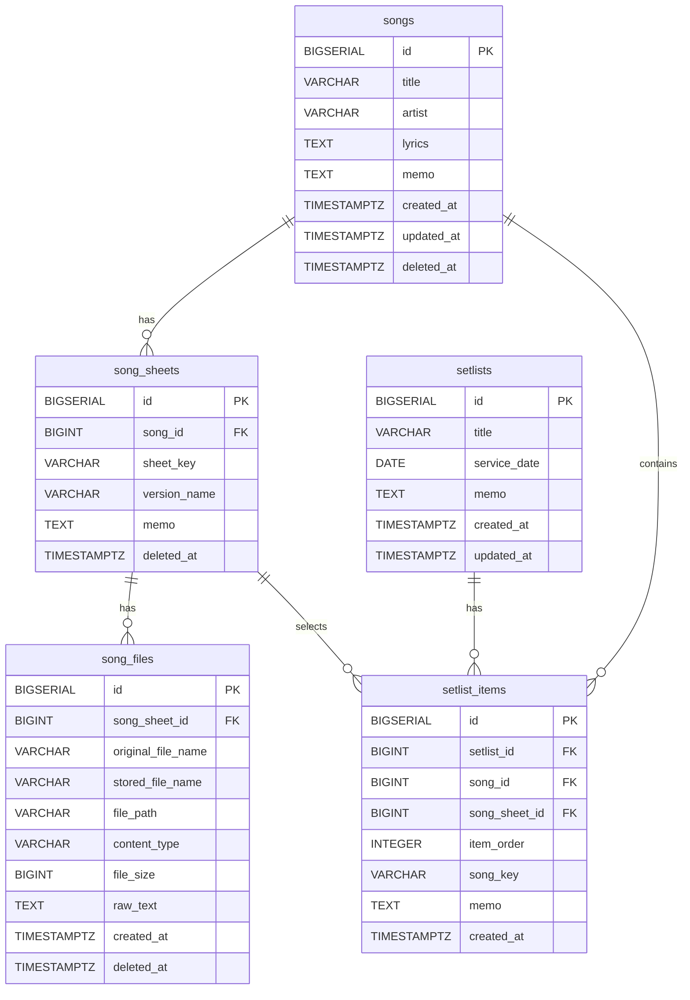

# 악보 정리 앱 (sheet-music)

예배·공연용 악보를 곡 단위로 관리하고, 셋리스트(콘티)를 구성하는 웹 애플리케이션.

## 주요 기능

- **곡 관리** — 곡 등록·수정·삭제, 아티스트·코드·가사 정보 관리
- **악보 버전 관리** — 같은 곡의 키별·버전별 악보 파일 분리 보관
- **OCR 자동 분석** — 악보 이미지 업로드 시 제목·코드·아티스트·가사 자동 추출
- **일괄 업로드** — 드래그앤드롭으로 여러 악보를 한 번에 OCR 분석 후 저장
- **셋리스트(콘티) 구성** — 곡 순서 지정, 악보 버전 선택, PDF 다운로드
- **통합 검색** — 제목·아티스트·가사·코드 통합 검색

## 기술 스택

| 구분 | 기술 |
|------|------|
| 백엔드 | Java 17, Spring Boot, Gradle |
| 프론트엔드 | Vue 3, TypeScript, Tailwind CSS v4 |
| DB | PostgreSQL (Supabase) |
| 스토리지 | Cloudflare R2 (로컬 모드 전환 가능) |
| OCR | Python, EasyOCR (Fly.io 별도 서비스) |
| 인프라 | Docker Compose, Fly.io (백엔드), Vercel (프론트엔드) |

## 배포 환경

| 서비스 | URL |
|--------|-----|
| 프론트엔드 | https://worship-sheet.vercel.app |
| 백엔드 API | https://worship-sheet.fly.dev |
| OCR 서비스 | https://worship-sheet-ocr.fly.dev |

`main` 브랜치에 push하면 GitHub Actions를 통해 백엔드·프론트엔드 자동 배포됩니다.

## 로컬 개발 환경 실행

### 사전 요구사항
- Java 17+
- Node.js 20+
- Docker Compose

### 백엔드

```bash
# 환경변수 설정 (.env 파일 생성 또는 직접 export)
cp .env.example .env

# DB 실행 (Docker)
docker compose up -d db

# 백엔드 실행
./gradlew bootRun
```

### 프론트엔드

```bash
cd frontend

# 환경변수 설정
echo "VITE_API_BASE_URL=http://localhost:8080" > .env.local

# 의존성 설치 및 실행
npm install
npm run dev
```

## 도메인 구조

```
songs (곡)
  └── song_sheets (악보 버전, 키별)
        └── song_files (악보 파일, PDF/이미지)

setlists (셋리스트/콘티)
  └── setlist_items (곡 순서, 사용할 악보 버전 포함)
```

## ERD



## 주요 설계 결정

- 삭제는 모두 **soft delete** (`deleted_at` 기록 방식)
- 파일 저장 경로: `./uploads/sheets/{songSheetId}/` (파일명은 UUID)
- `sheet_key`, `version_name`은 선택사항이며, 같은 곡 안에서 동일 키 중복 허용
- OCR은 파일 업로드 직후 비동기(`@Async`)로 실행, 프론트는 폴링으로 결과 반영
- 스토리지는 `STORAGE_TYPE` 환경변수로 `local` / `r2` 전환 가능

## API

### Songs

| Method | Path | Description |
|--------|------|-------------|
| `GET` | `/api/songs` | 곡 목록 조회 (검색 파라미터: `q`, `sheetKey`) |
| `POST` | `/api/songs` | 곡 등록 |
| `GET` | `/api/songs/{id}` | 곡 단건 조회 (악보 버전 포함) |
| `PUT` | `/api/songs/{id}` | 곡 수정 |
| `DELETE` | `/api/songs/{id}` | 곡 삭제 (soft delete) |
| `PATCH` | `/api/songs/{id}/lyrics` | 가사 수정 |

### Song Sheets

| Method | Path | Description |
|--------|------|-------------|
| `POST` | `/api/songs/{songId}/sheets` | 악보 버전 추가 |
| `GET` | `/api/songs/{songId}/sheets` | 악보 버전 목록 조회 |
| `GET` | `/api/song-sheets/{id}` | 악보 버전 단건 조회 |
| `PUT` | `/api/song-sheets/{id}` | 악보 버전 수정 |
| `DELETE` | `/api/song-sheets/{id}` | 악보 버전 삭제 (soft delete) |

### Song Files

| Method | Path | Description |
|--------|------|-------------|
| `POST` | `/api/song-sheets/{id}/files` | 파일 업로드 (multipart) |
| `GET` | `/api/song-files/{id}/view` | 파일 인라인 조회 |
| `GET` | `/api/song-files/{id}/download` | 파일 다운로드 |
| `DELETE` | `/api/song-files/{id}` | 파일 삭제 (soft delete) |

### Setlists

| Method | Path | Description |
|--------|------|-------------|
| `GET` | `/api/setlists` | 셋리스트 목록 조회 |
| `POST` | `/api/setlists` | 셋리스트 생성 |
| `GET` | `/api/setlists/{id}` | 셋리스트 단건 조회 (아이템 포함) |
| `PUT` | `/api/setlists/{id}` | 셋리스트 수정 |
| `DELETE` | `/api/setlists/{id}` | 셋리스트 삭제 |
| `POST` | `/api/setlists/{id}/items` | 아이템 추가 |
| `PUT` | `/api/setlists/{id}/items/reorder` | 아이템 순서 변경 |
| `DELETE` | `/api/setlist-items/{itemId}` | 아이템 삭제 |
